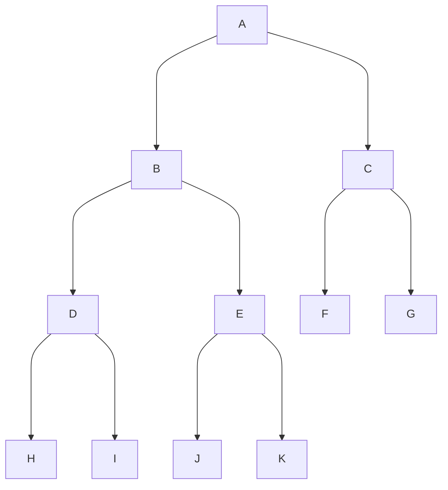

# Storage


```rust
let storage = Storage::temporary();
let table = storage.get("table name");

for item: Type in table.iter() {
    
}
```


```rust
struct Entry<K: ToBytes> {
    
}

impl<K: ToBytes, T: DeserializeOwned> IntoIterator for Entry<K> {
    
}
```



